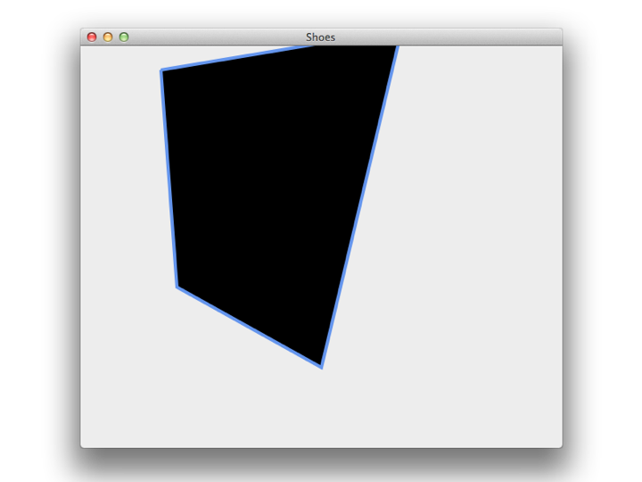
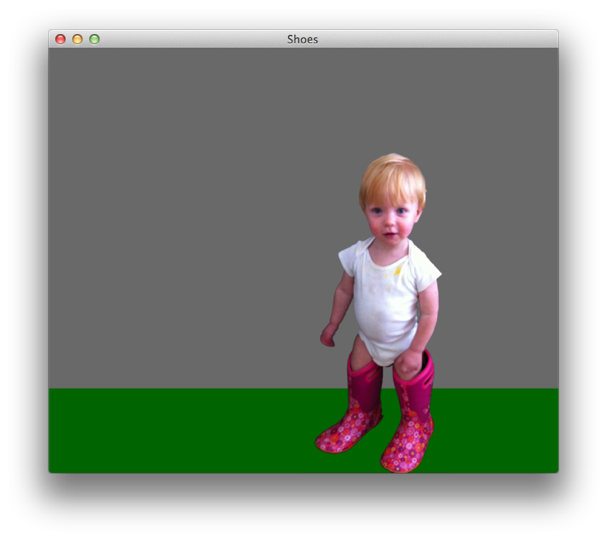

# Hackety ♥ Art #

## Shapes ##

``` ruby
  stroke goldenrod
  strokewidth 3
  fill hotpink
  oval 100, 200, 200
  fill yellowgreen
  rect 200, 100, 150, 150
  fill lightsteelblue
  star 400, 150
```

---


## Pinwheel ##

``` ruby 
  sirius = star 400, 150
  animate do |frame|
    sirius.remove
    rotate frame
    sirius = star 400, 150
  end
```

## Freeform drawing ##

``` ruby
  shape do
    stroke cornflowerblue
    strokewidth 4
    move_to 100, 30
    line_to 400, -20
    line_to 300, 400
    line_to 120, 300
    line_to 100, 30
  end
```

---



## Images ##

``` ruby
  background dimgray
  fill darkgreen
  nostroke
  rect 0, 400, 600, 100
  image "/Users/eric/mateo.png",
    :left => 300, :top => 112
```

---


