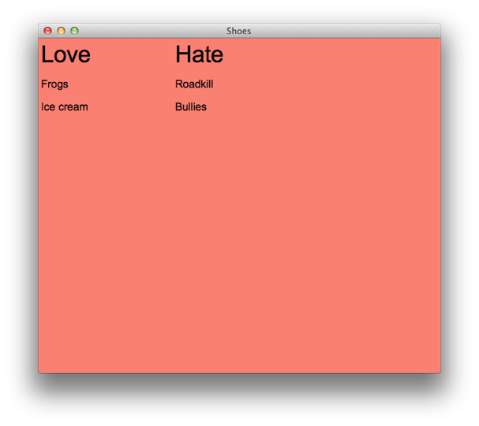

# Hackety ♥ Slots #

## Flows are rivers ##

``` ruby
flow do
  title "the"
  title "quick"
  title "brown"
  title "fox"
  title "jumped"
end
```

---


## Stacks are towers ##

``` ruby
stack do
  title "the"
  title "quick"
  title "brown"
  title "fox"
  title "jumped"
end
```

---


## Slots within slots ##

``` ruby
  flow do
    stack :width => 200 do
      subtitle "Love"
      para "Frogs"
      flow do
        para "Ice"
        para "cream"
      end
    end # continued...
```


## Slots within (cont.) ##

``` ruby
    stack :width => 200 do
      subtitle "Hate"
      para "Roadkill"
      para "Bullies"
    end
  end
```

---


